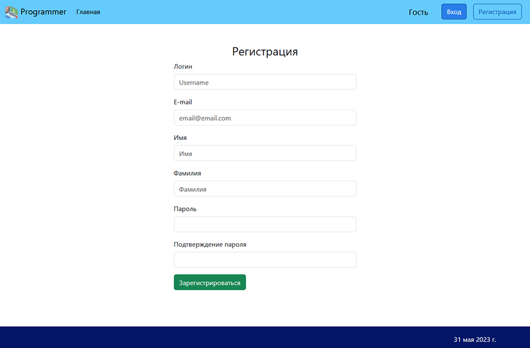
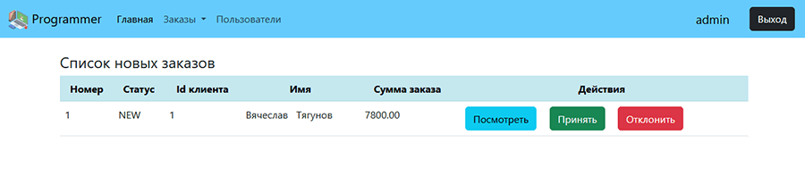
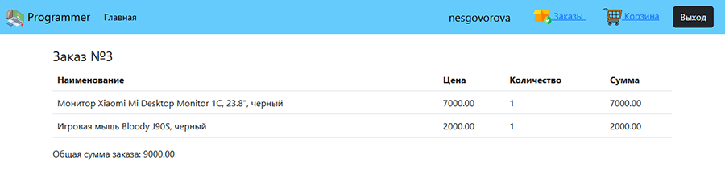
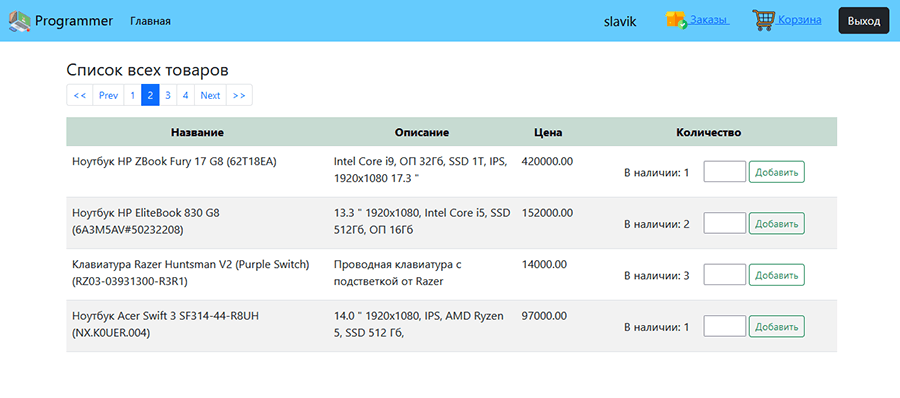
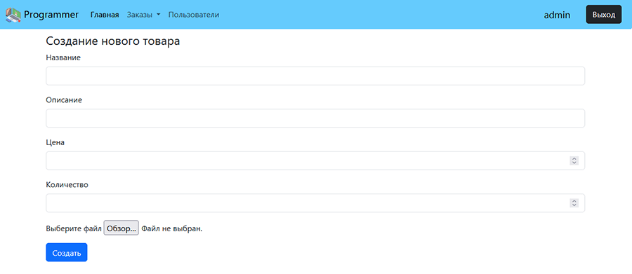
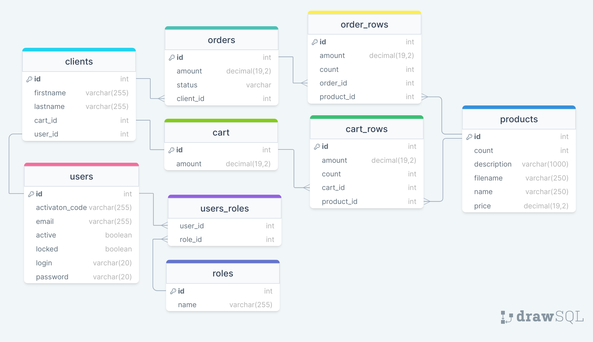

# Store management. Проект интернет-магазина на основе Spring MVC

### Краткое описание
В проекте реализовано web-приложение (интернет-магазин) на основе фреймворка Spring Boot.  
Для управления данными использована СУБД MySQL.

### Технологии
__Backend:__
+ Spring Boot
+ Spring MVC
+ Spring Data JPA
+ Spring Security
+ Spring Validator
+ Java Mail
+ Hibernate
+ Lombok

__Хранение данных:__
+ MySql

__Frontend:__
+ Thymeleaf
+ HTML
+ CSS
+ Bootstrap

__Testing:__
+ H2 
+ Mockito
+ JUnit

### Возможности приложения
__Пользователю:__  
✅ Зарегистрироваться в качестве покупателя и активация почты, указанной при регистрации.  
✅ Выбрать доступные для заказа товары и добавить их в корзину.  
✅ Просмотр корзины и изменение ее состава.  
✅ Оформление заказа.  
✅ Просмотр оформленных заказов.  
✅ Редактирование данных профиля (имя, фамилия, пароль).  

__Администратору:__  
✅ Посмотреть информацию о клиентах (всех зарегистрированных клиентов, корзины клиентов, заказы клиентов).  
✅ Посмотреть информацию о заказах (все заказы, только новые, завершенные, принятые заказы или заказы в процессе) и изменить статус заказа.  
✅ Добавление новых товаров.  
✅ Увеличение количества созданных товаров.

### Страница регистрации


### Страница авторизации


### После регистрации на почту пользователя приходит сообщение о необходимости подтвердить указанную при регистрации почту


### Начальная страница админа


### Страница пользователей (для админа)


### Страница заказов (для админа)


### Страница просмотра заказа


### Страница корзины пользователя


### Страница просмотра доступных товаров


### Страница для добавления новых товаров (для админа)


### Пример кода
Контроллер по обработке запросов на /products и метод, обрабатывающий end-point /products/all
```java
@Controller
@RequiredArgsConstructor
@PreAuthorize("hasAnyRole('ROLE_ADMIN', 'ROLE_USER')")
@RequestMapping("/products")
public class ProductController {
    private final AppUserService appUserService;
    private final ProductService productService;

    @GetMapping("/all")
    public String getAllProducts(@RequestParam(defaultValue = "1") int page,
                                 @RequestParam(defaultValue = "4") int size, Model model) {
        List<Product> products;
        Pageable paging = PageRequest.of(page - 1, size);

        Page<Product> pageProducts = productService.getAllProducts(paging);

        products = pageProducts.getContent();

        model.addAttribute("products", products);
        model.addAttribute("currentPage", pageProducts.getNumber() + 1);
        model.addAttribute("totalItems", pageProducts.getTotalElements());
        model.addAttribute("totalPages", pageProducts.getTotalPages());
        model.addAttribute("pageSize", size);

        return "/product/products";
    }
}
```

Сервис по работе с запросами о товарах
```java
@Service
@RequiredArgsConstructor
public class ProductService {
    private final ProductRepository productRepository;

    @Transactional(readOnly = true)
    public Page<Product> getAllProducts(Pageable paging) {
        return productRepository.findAll(paging);
    }
}
```

Класс по работе с таблицей базы данных "products"
```java
@Repository
public interface ProductRepository extends JpaRepository<Product, Integer> {
    Page<Product> findAll(Pageable pageable);
}
```

### Схема базы данных 
